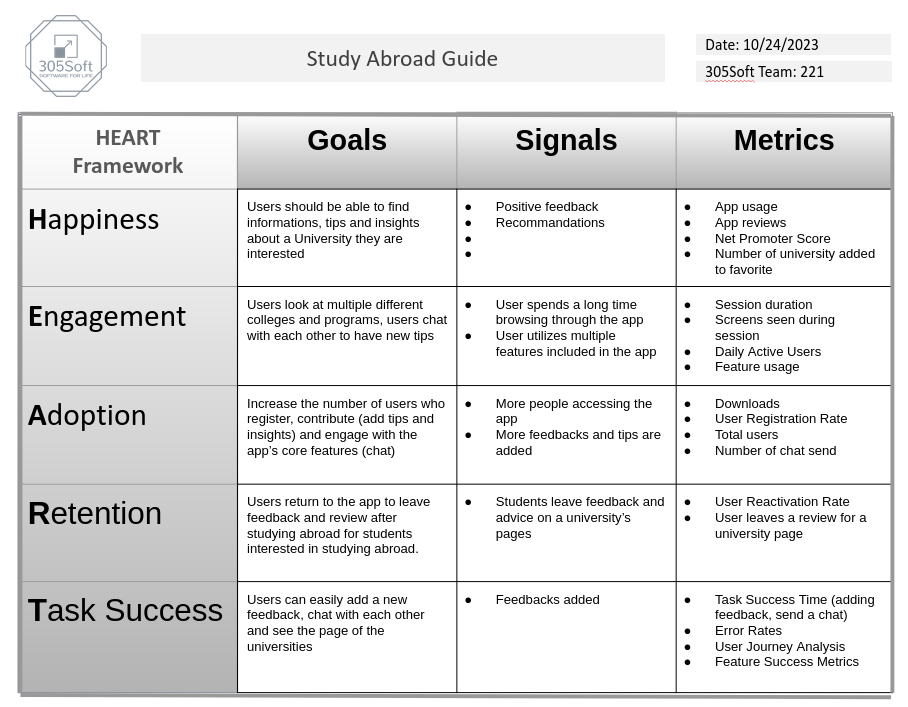

# Metrics for our project 

## Google HEART framework 

## How the metrics will be collected
- Feature Success Metric (Chat feature) - use the events like "Chat Initiation", "Message Sent" and "Message Received" from Firebase Analytics to calculate the success rate of this feature.
- User Journey Analysis - Use "first_visit", "session_start", and "page_view" events from Firebase Analytics to monitor and understand how users are utilizing the app.
- Metric 3 - Feature Success Metric (search and filtering) - use "Bounce Rate", "User Timng", and "Event tracking" to callculate how effective the search and filtering in keeping users engaged. 
- Metric 4 - Error Rates Metric - use "Error Handling" from Firebase in order to catch errors and handling for smoother sessions in our and for our to not crash on users end.
